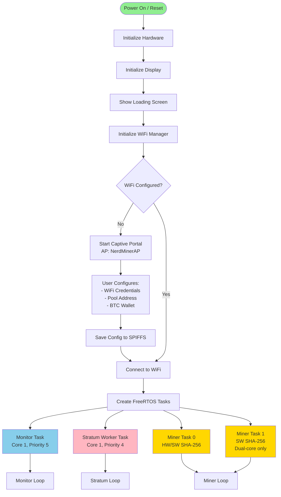
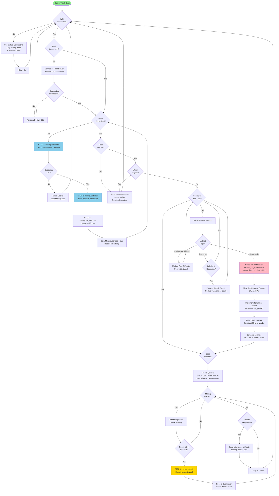
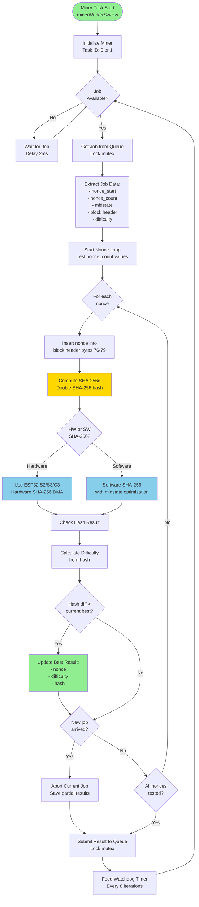
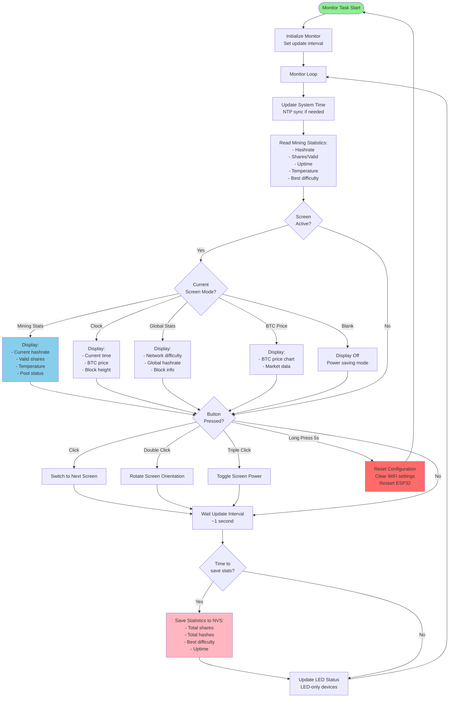
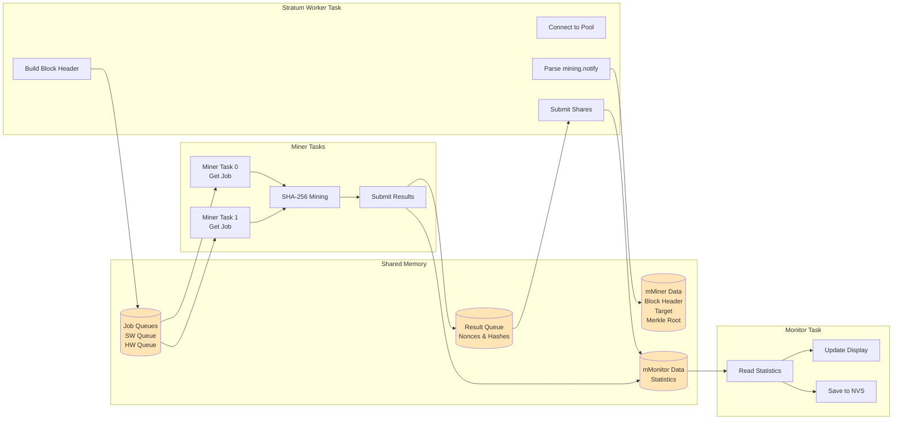

# NerdMiner v2 - Mining Flow Flowchart

This document provides a comprehensive flowchart of the NerdMiner v2 mining operation, showing the flow from startup to mining execution.

## System Architecture Overview

NerdMiner v2 uses FreeRTOS tasks running on ESP32 microcontrollers to implement Bitcoin solo mining:
- **Monitor Task** (Core 1, Priority 5) - Display updates and statistics
- **Stratum Worker Task** (Core 1, Priority 4) - Pool communication and job management
- **Miner Tasks** (Core 0/1, Priority 1-3) - SHA-256 mining execution

---

## Main System Flow



---

## Stratum Worker Task Flow



---

## Miner Worker Task Flow



---

## Monitor Task Flow



---

## Data Flow Between Tasks



---

## Key Data Structures

### miner_data
```cpp
typedef struct {
    uint8_t bytearray_target[32];        // Mining difficulty target
    uint8_t bytearray_pooltarget[32];    // Pool difficulty target
    uint8_t merkle_result[32];           // Merkle root
    uint8_t bytearray_blockheader[128];  // Bitcoin block header
} miner_data;
```

### mining_job
```cpp
typedef struct {
    String job_id;
    String prev_block_hash;
    String coinb1, coinb2;     // Coinbase parts
    String nbits;              // Difficulty bits
    JsonArray merkle_branch;   // Merkle branch
    String version;
    uint32_t target;
    String ntime;
    bool clean_jobs;
} mining_job;
```

### mining_subscribe
```cpp
typedef struct {
    String sub_details;
    String extranonce1;
    String extranonce2;
    int extranonce2_size;
    char wName[80];  // Wallet address
    char wPass[20];  // Pool password
} mining_subscribe;
```

---

## Mining Process Details

### Block Header Construction (80 bytes)
```
Bytes  0-3:   Version
Bytes  4-35:  Previous Block Hash
Bytes 36-67:  Merkle Root (includes coinbase with extranonce)
Bytes 68-71:  nTime
Bytes 72-75:  nBits (difficulty)
Bytes 76-79:  Nonce (tested by miner)
```

### SHA-256d Mining
1. **Midstate Optimization**: Pre-compute SHA-256 of first 64 bytes
2. **Nonce Testing**: Iterate through nonce space (4096 or 16384 per job)
3. **Double Hash**: SHA-256(SHA-256(block_header))
4. **Difficulty Check**: Compare hash to pool target
5. **Share Submission**: If hash meets difficulty, submit to pool

### Nonce Space Partitioning
- **Software Mining**: 4096 nonces per job
- **Hardware Mining**: 16,384 nonces per job
- **Dual-Core**: Task 0 and Task 1 test different nonce ranges
- **Random Nonce**: Optional random nonce selection for variety

---

## Performance Characteristics

### Typical Hashrates
- **ESP32 (Software SHA-256)**: ~10-15 kH/s per core
- **ESP32-S2/S3 (Hardware SHA-256)**: ~50-80 kH/s
- **ESP32-C3 (Hardware SHA-256)**: ~40-70 kH/s
- **Dual-Core ESP32**: ~25-30 kH/s total

### Watchdog Timers
- **General WDT**: 3 seconds (for all tasks except mining)
- **Miner WDT**: 15 minutes (mining tasks only)
- **Core 0 WDT**: Disabled (mining fully utilizes core)

### Task Priorities
1. **Monitor Task**: Priority 5 (highest) - Ensures UI responsiveness
2. **Stratum Worker**: Priority 4 - Timely pool communication
3. **Miner HW Task**: Priority 3 - Hardware-accelerated mining
4. **Miner SW Tasks**: Priority 1 - Software mining

---

## Error Handling and Recovery

### Connection Failures
- WiFi disconnect → Auto-reconnect with 5s retry
- Pool disconnect → Random 1-60s delay before retry
- Pool inactivity (2min) → Socket reset and reconnection
- No jobs (10min) → Full connection reset

### Mining Failures
- Invalid job data → Skip and continue
- Job timeout → Abort current work, get new job
- Difficulty too low → Auto-suggest higher difficulty

### Display and Buttons
- Button long press (5s) → Factory reset
- Display blank mode → Power saving
- Touch/button error → Restart display driver

---

## Configuration Options

### Pool Configuration
- **Pool Address**: Stratum pool URL
- **Pool Port**: Typically 3333 or 21496
- **BTC Wallet**: Bitcoin address for payouts
- **Pool Password**: Usually "x" or worker name

### WiFi Configuration
- **SSID**: WiFi network name
- **Password**: WiFi password
- **Fallback**: Captive portal mode if connection fails

### Display Options
- **Screen Rotation**: 0°, 90°, 180°, 270°
- **Brightness**: Auto or manual
- **Screen Timeout**: Blank screen for power saving

---

## References

- **Main Entry**: `src/NerdMinerV2.ino.cpp`
- **Mining Logic**: `src/mining.cpp` and `src/mining.h`
- **Stratum Protocol**: `src/stratum.cpp` and `src/stratum.h`
- **Display Drivers**: `src/drivers/displays/`
- **WiFi Manager**: `src/wManager.cpp` and `src/wManager.h`
- **Monitor System**: `src/monitor.cpp` and `src/monitor.h`

---

*Generated: 2026-01-17*
*NerdMiner v2 - Open Source ESP32 Bitcoin Miner*
